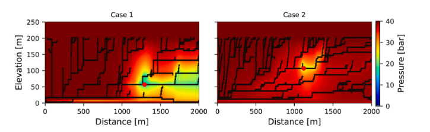
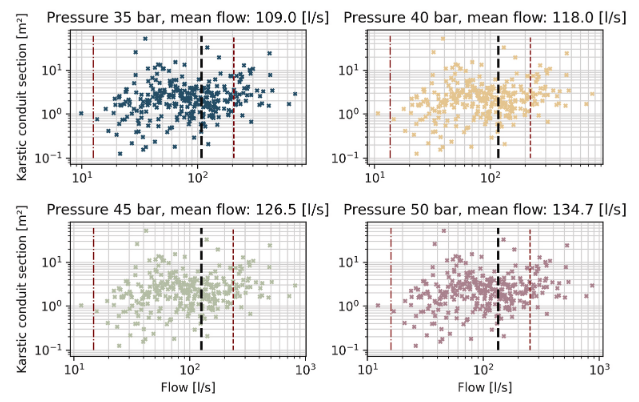

# Tunnel Karstic Inflow Estimation

## Overview

This repository presents a stochastic modelling framework to estimate groundwater inflows into tunnels excavated in karstified carbonate rocks.  
The codes provided here support the methodology developed in a scientific study. Raw input data are not publicly available.

## Related publication

Dallalba et al. (2022), *Journal of Hydrology*.  
https://www.sciencedirect.com/science/article/pii/S0013795222004355

## Methodological workflow
Each step of the process is stochastic, and the full methodology relies on repeating this workflow through Monte Carlo simulations.

### Step 1 – 3D karst network simulation (PyKasso)

- Stochastic generation of fracture and karst conduit networks.
- Definition of inlet locations and computation of network geometry.
- Simulations performed using the **PyKasso** package.

### Step 2 – Conduit aperture simulation (Geone)

- Stochastic simulation of conduit diameters.
- Gaussian Random Fields (GRF) generated with the geostatistical package **Geone**.
- Statistical distributions derived from the literature.

### Step 3 – 3D flow simulation (DISCO)

- 3D meshing of the karst network.
- Definition of boundary conditions and tunnel location.
- Hydraulic flow simulations performed with the proprietary software **DISCO**.
- Computation of one possible tunnel inflow rate for each realization.

### Monte Carlo framework

The three steps above are repeated many times to explore the full range of possible hydraulic behaviours.  
Monte Carlo simulations are used to obtain statistical distributions of tunnel breakthrough discharge rates.

An a posteriori analysis of conduit friction coefficients is also performed and compared with analytical formulations and literature values.

## Example of results

-------------------------------------------------

## Repository structure

Tunnel_karstic_inflow_estimation/
├── 00_test_bernouilli_weisbach/
├── 01_test_karst_network_generator/
└── 02_final_results/

## Notes

- Raw geological and tunnel data are not included.
- Codes are provided to support the methodology and may require adaptation for other applications.

